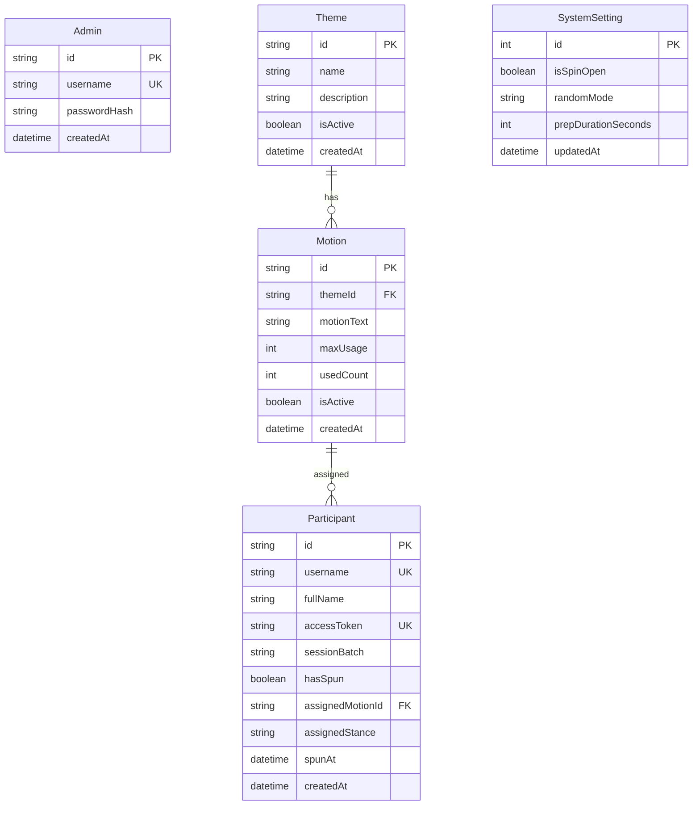

# Spesifikasi Skema Basis Data SQLite & Prisma ORM

## Model Relasional
Aplikasi menggunakan Prisma ORM dengan SQLite sebagai engine basis data persisten.

```mermaid
erDiagram
    Admin {
        string id PK
        string username UK
        string passwordHash
        datetime createdAt
    }
    Theme ||--o{ Motion : has
    Theme {
        string id PK
        string name
        string description
        boolean isActive
        datetime createdAt
    }
    Motion ||--o{ Participant : assigned
    Motion {
        string id PK
        string themeId FK
        string motionText
        int maxUsage
        int usedCount
        boolean isActive
        datetime createdAt
    }
    Participant {
        string id PK
        string username UK
        string fullName
        string accessToken UK
        string sessionBatch
        boolean hasSpun
        string assignedMotionId FK
        string assignedStance
        datetime spunAt
        datetime createdAt
    }
    SystemSetting {
        int id PK
        boolean isSpinOpen
        string randomMode
        int prepDurationSeconds
        datetime updatedAt
    }
```
